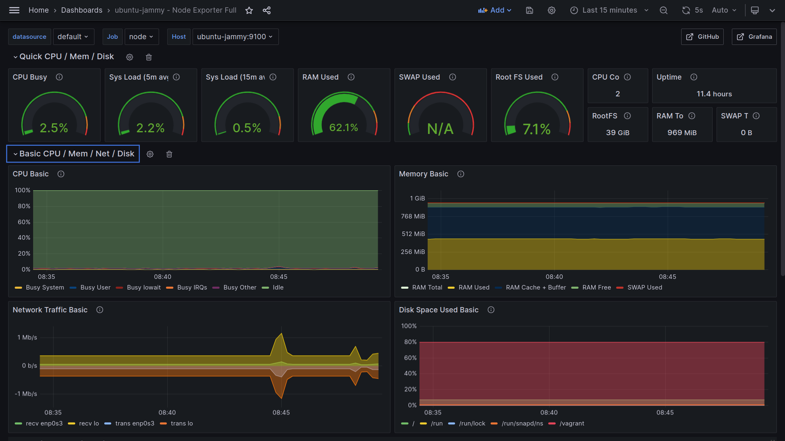

# Vagrant Prometheus Grafana Setup
Set up Prometheus and Grafana in a Vagrant created VM.

1. Start Vagrant VM
2. Append ssh config for Vagrant VM to local
3. Update Ansible inventory
4. Run Ansible playbook "main.yaml"
5. Forward port 3000 to host (may be added in Vagrant config)
6. Configure Grafana dashboards through web UI (http://localhost:3000), import below from Grafana dashboard templates.
    + https://grafana.com/grafana/dashboards/13978-node-exporter-quickstart-and-dashboard/
    + https://grafana.com/grafana/dashboards/1860-node-exporter-full/

